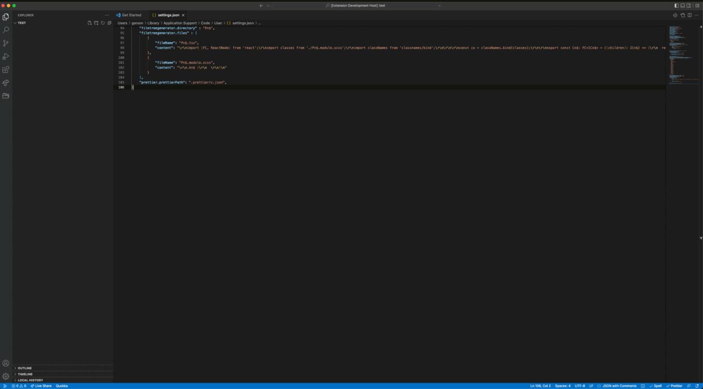

# Automate File Tree Generation

[Marketplace link](https://marketplace.visualstudio.com/items?itemName=GersonDiniz.file-tree-generate)

### How to use
- Right click on file explorer and then `Generate File Tree`, name it, that's it!

### Custom configuration

Follow these steps to create your custom configuration:

1. Open Settings menu through `Preferences > Settings` OR `Command` + `,`
2. Search for **filetreegenerator** and click on `Edit in settings.json` link under **filetreegenerator** option.

3. Inside `settings.json` type in `filetreegenerator.files` and hit enter. The default file configuration array will be automatically displayed.

4. Add/Remove objects from the `filetreegenerator.files` array.

#### Example

    "filetreegenerator.directory" : "Pn$",
    "filetreegenerator.files" : [
        {
            "fileName": "Pn$.tsx",
            "content": "\r\nimport {FC, ReactNode} from 'react';\r\nimport classes from './Pn$.module.scss';\r\nimport classNames from 'classnames/bind';\r\n\r\n\r\nconst cx = classNames.bind(classes);\r\n\r\nexport const Cn$: FC<ICn$> = ({children}: ICn$) => {\r\n  return (\r\n    
\r\n      {children}\r\n    
\r\n  );\r\n};\r\n\r\nexport interface ICn$ {\r\n  children?: ReactNode;\r\n}\n"
            },
        {
            "fileName": "Pn$.module.scss",
            "content": "\r\n.kn$ {\r\n  \r\n}\n"
        }
    ]

Entered name replacement keywords:
- `fn$` **entered name**
- `cN$` **camelCase** 
- `cn$` **camelCase** 
- `Cn$` **PascalCase** 
- `Pn$` **PascalCase** 
- `pn$` **PascalCase** 
- `kn$` **kebab-case** 
- `sn$` **snake_case**
- `Kn$` **SCREAMING-KEBAB-CASE** 
- `Sn$` **SCREAMING_SNAKE_CASE** 
